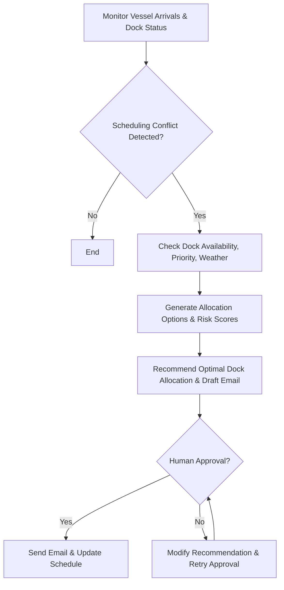
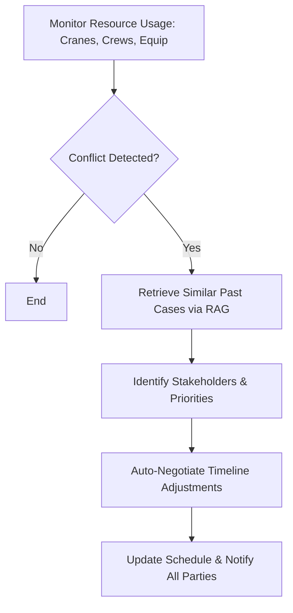
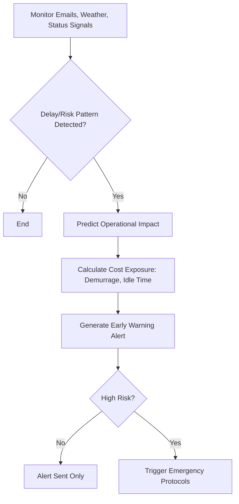
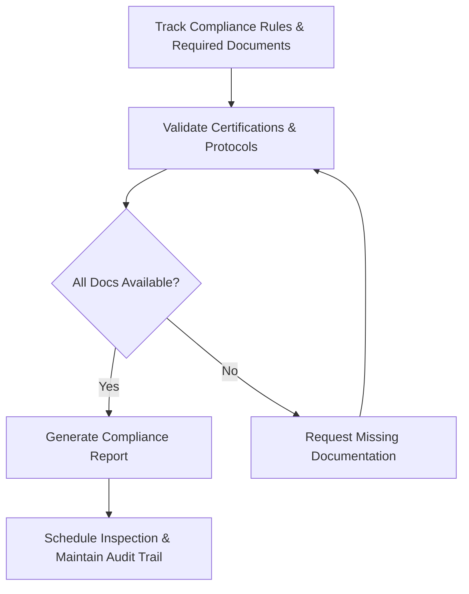
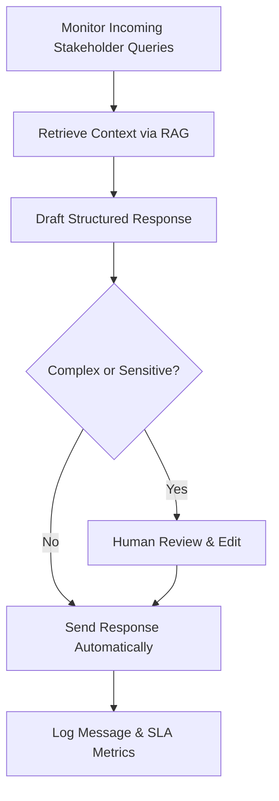
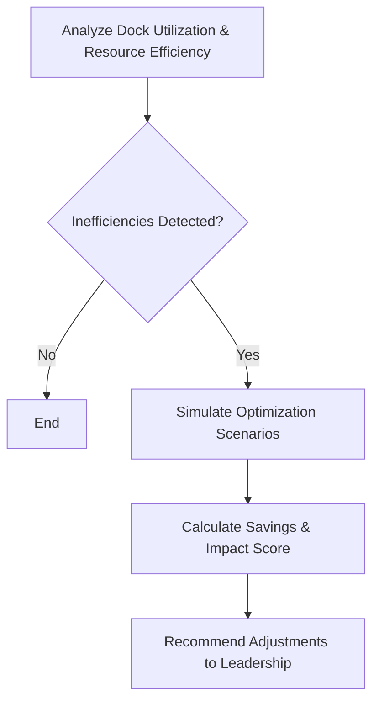

# Agentic Port Operations – LangGraph Flow Diagrams

This document contains block flow diagrams for six autonomous agents used in port operational intelligence, represented in Mermaid syntax.

---

## 1. Autonomous Dock Scheduler Agent

## 2. Conflict Resolution Agent

## 3. Proactive Alerts Agent

## 4. Compliance and Documentation Agent

## 5. Stakeholder Communication Agent

## 6. Cost Optimization Agent

